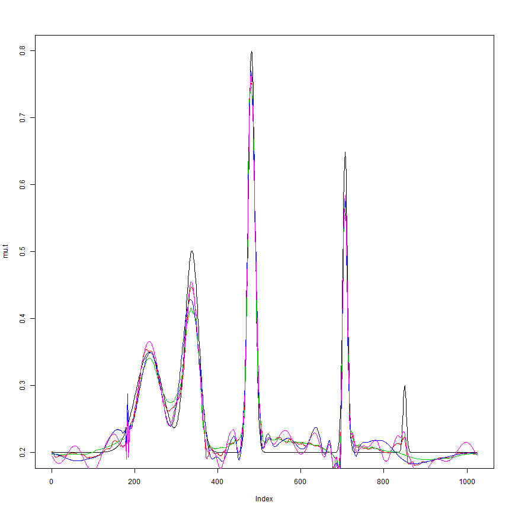
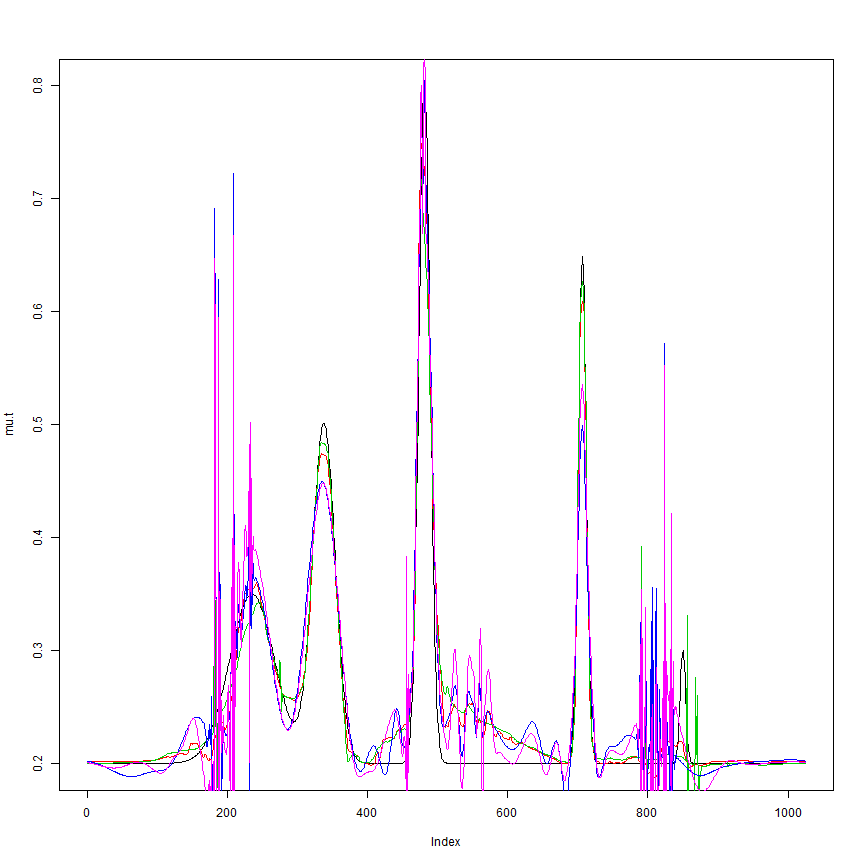
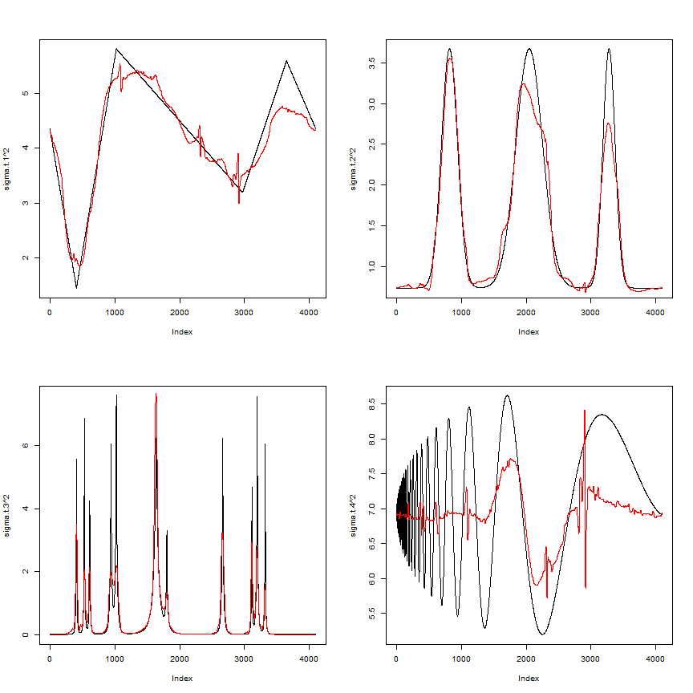
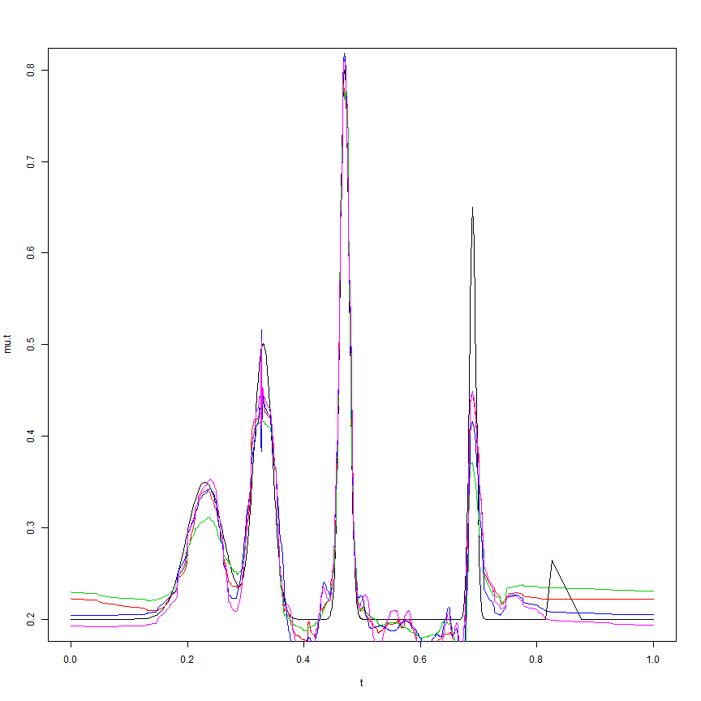
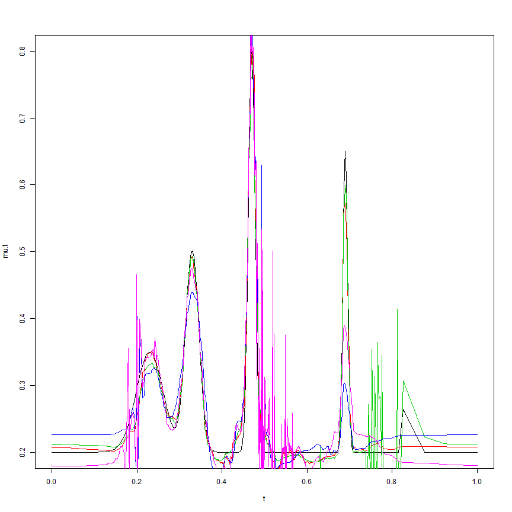
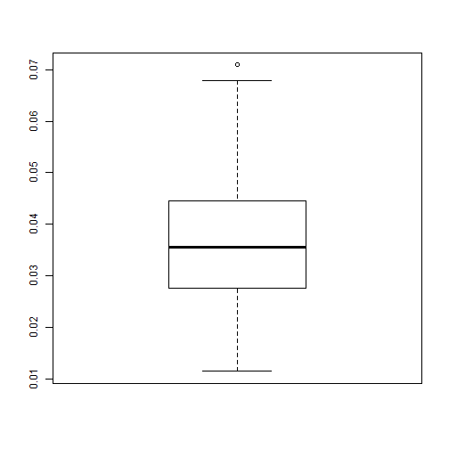
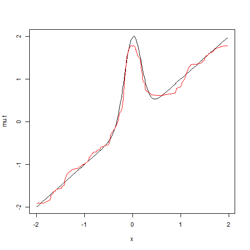
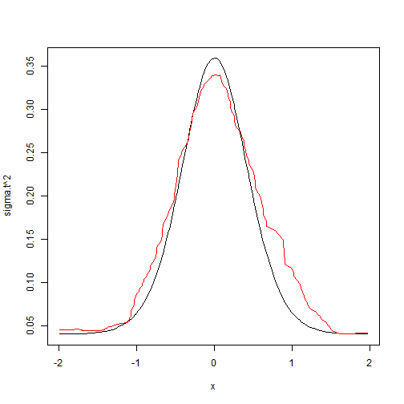
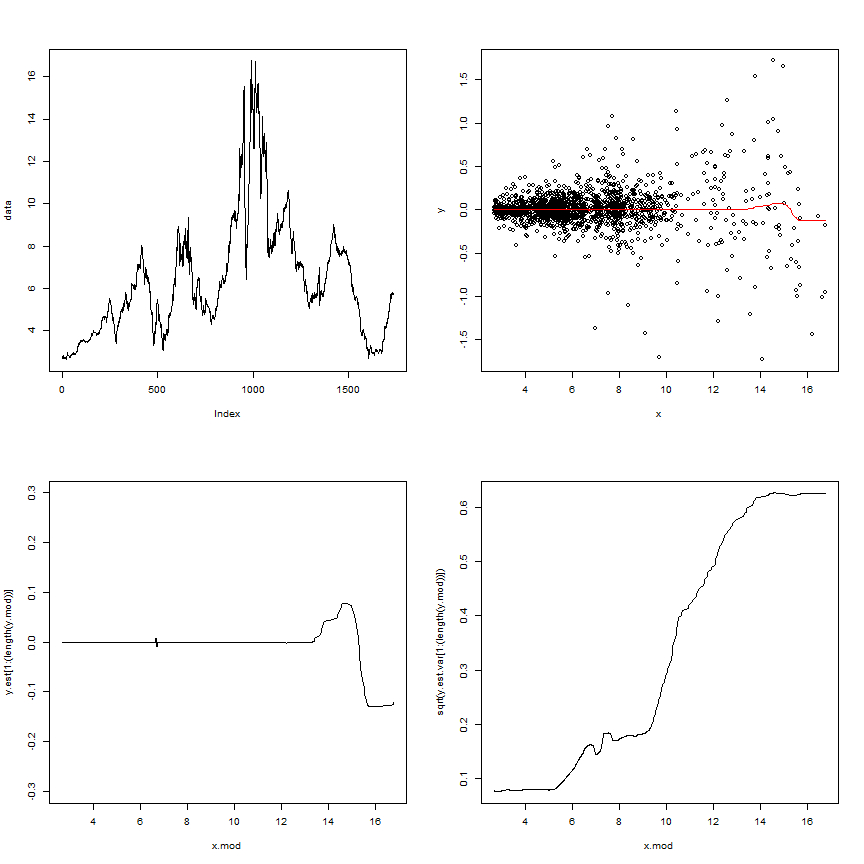
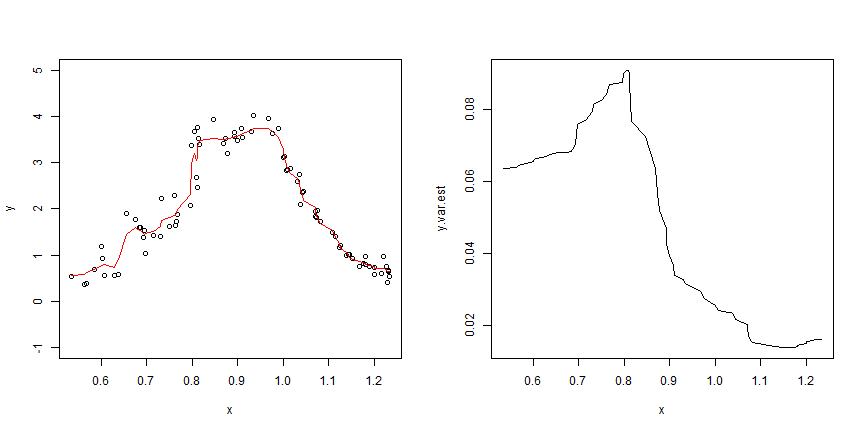

ASH based wavelet shrinkage for heteroskedastic models
========================================================

We assume a simple parametric model of the form
$y_i=\mu_i+\epsilon_i$
where $\epsilon_i\sim N(0,\sigma_i^2)$, and both $\mu$ and $\sigma$ are unknown. We use the procedure described in the documentation to estimate both the mean and the variances. Here we present a brief demonstration of the method.


We first look at mean estimation, which is our primary focus. A sample mean function is presented, as well as a couple of different variance functions. Our method is compared against a few other simple methods.


```r
spike.f = function(x) (0.75 * exp(-500 * (x - 0.23)^2) + 1.5 * exp(-2000 * (x - 
    0.33)^2) + 3 * exp(-8000 * (x - 0.47)^2) + 2.25 * exp(-16000 * (x - 0.69)^2) + 
    0.5 * exp(-32000 * (x - 0.83)^2))
n = 1024
t = 1:n/n
mu.s = spike.f(t)

library(wavethresh)
library(EbayesThresh)
library(caTools)
source(file.path("../Rcode/bayesmooth.R"))
source(file.path("../Rcode/ti_thresh.R"))

mse = function(x, y) mean((x - y)^2)
l2norm = function(x) sum(x^2)
mise = function(x, y, r) 10000 * mean(apply(x - rep(1, r) %o% y, 1, l2norm)/l2norm(y))
sig.est.func = function(x, n) sqrt(2/(3 * (n - 2)) * sum((1/2 * x[1:(n - 2)] - 
    x[2:(n - 1)] + 1/2 * x[3:n])^2))

## Default R wavelet method, written into a single function
waveti.u = function(x, filter.number = 10, family = "DaubLeAsymm", min.level = 3, 
    noise.level) {
    TT <- length(x)
    thresh <- noise.level * sqrt(2 * log(TT))
    x.w <- wd(x, filter.number, family, type = "station")
    x.w.t <- threshold(x.w, levels = (min.level):(x.w$nlevels - 1), policy = "manual", 
        value = thresh, type = "hard")
    x.w.t.r <- AvBasis(convert(x.w.t))
    return(x.w.t.r)
}

waveti.ebayes = function(x, filter.number = 10, family = "DaubLeAsymm", min.level = 3, 
    noise.level) {
    n = length(x)
    J = log2(n)
    x.w <- wd(x, filter.number, family, type = "station")
    for (j in min.level:(J - 1)) {
        x.pm = ebayesthresh(accessD(x.w, j), sdev = noise.level)
        x.w = putD(x.w, j, x.pm)
    }
    mu.est = AvBasis(convert(x.w))
    return(mu.est)
}

## mean function
mu.t = (1 + mu.s)/5

## signal to noise ratio
rsnr = sqrt(1)

## variance functions
var1 = rep(1, n)
var2 = (1e-04 + 4 * (exp(-550 * (t - 0.2)^2) + exp(-200 * (t - 0.5)^2) + exp(-950 * 
    (t - 0.8)^2)))/1.35
```


We first look at the case of constant variance

```r
## constant variance
sigma.ini = sqrt(var1)
sigma.t = sigma.ini/mean(sigma.ini) * sd(mu.t)/rsnr^2

set.seed(327)
X.s = matrix(rnorm(10 * n, mu.t, sigma.t), nrow = 10, byrow = TRUE)

mu.est = apply(X.s, 1, bayesmooth)
mu.est.tivar.ash = apply(X.s, 1, ti.thresh, method = "bayesm")
mu.est.tivar.mad = apply(X.s, 1, ti.thresh, method = "rmad")

mu.est.ti = matrix(0, 10, n)
mu.est.ti.ebayes = matrix(0, 10, n)
for (i in 1:10) {
    sig.est = sig.est.func(X.s[i, ], n)
    mu.est.ti[i, ] = waveti.u(X.s[i, ], noise.level = sig.est)
    mu.est.ti.ebayes[i, ] = waveti.ebayes(X.s[i, ], noise.level = sig.est)
}

## MISEs

## Bayesmooth
mise(t(mu.est), mu.t, 10)
```

```
## [1] 58.95
```

```r
## TI thresholding with variance estimated from bayesmooth
mise(t(mu.est.tivar.ash), mu.t, 10)
```

```
## [1] 67.2
```

```r
## TI thresholding with variance estimated from running MAD
mise(t(mu.est.tivar.mad), mu.t, 10)
```

```
## [1] 73.75
```

```r
## TI thresholding with constant variance (estimated)
mise(mu.est.ti, mu.t, 10)
```

```
## [1] 87.7
```

```r
## EBayes with constant variance (estimated)
mise(mu.est.ti.ebayes, mu.t, 10)
```

```
## [1] 75.02
```


```r

plot(mu.t, type = "l")
lines(mu.est[, 1], col = 2)
lines(mu.est.tivar.mad[, 1], col = 3)
lines(mu.est.ti[1, ], col = 4)
lines(mu.est.ti.ebayes[1, ], col = 6)
```

 


We then look at the case of non-constant variance

```r
## non-constant variance
sigma.ini = sqrt(var2)
sigma.t = sigma.ini/mean(sigma.ini) * sd(mu.t)/rsnr^2

set.seed(327)
X.s = matrix(rnorm(10 * n, mu.t, sigma.t), nrow = 10, byrow = TRUE)

mu.est = apply(X.s, 1, bayesmooth)
mu.est.tivar.ash = apply(X.s, 1, ti.thresh, method = "bayesm")
mu.est.tivar.mad = apply(X.s, 1, ti.thresh, method = "rmad")

mu.est.ti = matrix(0, 10, n)
mu.est.ti.ebayes = matrix(0, 10, n)
for (i in 1:10) {
    sig.est = sig.est.func(X.s[i, ], n)
    mu.est.ti[i, ] = waveti.u(X.s[i, ], noise.level = sig.est)
    mu.est.ti.ebayes[i, ] = waveti.ebayes(X.s[i, ], noise.level = sig.est)
}

## MISEs

## Bayesmooth
mise(t(mu.est), mu.t, 10)
```

```
## [1] 106.2
```

```r
## TI thresholding with variance estimated from bayesmooth
mise(t(mu.est.tivar.ash), mu.t, 10)
```

```
## [1] 124.8
```

```r
## TI thresholding with variance estimated from running MAD
mise(t(mu.est.tivar.mad), mu.t, 10)
```

```
## [1] 180.5
```

```r
## TI thresholding with constant variance (estimated)
mise(mu.est.ti, mu.t, 10)
```

```
## [1] 400.4
```

```r
## EBayes with constant variance (estimated)
mise(mu.est.ti.ebayes, mu.t, 10)
```

```
## [1] 431.2
```


```r
plot(mu.t, type = "l")
lines(mu.est[, 1], col = 2)
lines(mu.est.tivar.mad[, 1], col = 3)
lines(mu.est.ti[1, ], col = 4)
lines(mu.est.ti.ebayes[1, ], col = 6)
```

 


Next we look at variance estimation. Because variance estimation is much harder, we use a larger sample size. Here $n=4096$. 


```r
n = 2^12
t = 1:n/n
mu.s = spike.f(t)


pos = c(0.1, 0.13, 0.15, 0.23, 0.25, 0.4, 0.44, 0.65, 0.76, 0.78, 0.81)
hgt = c(2, 3.6, 2, 5, 7.5, 6.9, 2, 4.8, 2, 4.1, 2.3)
wth = c(0.005, 0.005, 0.006, 0.01, 0.01, 0.03, 0.01, 0.01, 0.005, 0.008, 0.005)
mu.b = rep(0, n)
for (j in 1:length(pos)) {
    mu.b = mu.b + hgt[j]/((1 + (abs(t - pos[j])/wth[j]))^4)
}
dop.f = function(x) sqrt(x * (1 - x)) * sin((2 * pi * 1.05)/(x + 0.05))
mu.dop = dop.f(t)

var1 = 1.42 * ((3 - 20 * t) * (t >= 0 & t < 0.1) + (20 * t - 1) * (t >= 0.1 & 
    t < 0.25) + (4 + (1 - 4 * t) * 18/19) * (t >= 0.25 & t < 0.725) + (2.2 + 
    10 * (t - 0.725)) * (t >= 0.725 & t < 0.89) + (3.85 - 85 * (t - 0.89)/11) * 
    (t >= 0.89 & t <= 1))
var2 = (1 + 4 * (exp(-550 * (t - 0.2)^2) + exp(-200 * (t - 0.5)^2) + exp(-950 * 
    (t - 0.8)^2)))/1.35
var3 = mu.b
var4 = 3.4 * (2 + mu.dop)

sigma.t.1 = sqrt(var1)
sigma.t.2 = sqrt(var2)
sigma.t.3 = sqrt(var3)
sigma.t.4 = sqrt(var4)


set.seed(327)
X.s.1 = rnorm(n, 0, sigma.t.1)
set.seed(327)
X.s.2 = rnorm(n, 0, sigma.t.2)
set.seed(327)
X.s.3 = rnorm(n, 0, sigma.t.3)
set.seed(327)
X.s.4 = rnorm(n, 0, sigma.t.4)

var.est.1 = bayesmooth(X.s.1, v.est = TRUE)
var.est.2 = bayesmooth(X.s.2, v.est = TRUE)
var.est.3 = bayesmooth(X.s.3, v.est = TRUE)
var.est.4 = bayesmooth(X.s.4, v.est = TRUE)

mse(var.est.1, sigma.t.1^2)
```

```
## [1] 0.07699
```

```r
mse(var.est.2, sigma.t.2^2)
```

```
## [1] 0.05085
```

```r
mse(var.est.3, sigma.t.3^2)
```

```
## [1] 0.1886
```

```r
mse(var.est.4, sigma.t.4^2)
```

```
## [1] 0.6115
```


```r
par(mfrow = c(2, 2))
plot(sigma.t.1^2, type = "l")
lines(var.est.1, col = 2)
plot(sigma.t.2^2, type = "l")
lines(var.est.2, col = 2)
plot(sigma.t.3^2, type = "l")
lines(var.est.3, col = 2)
plot(sigma.t.4^2, type = "l")
lines(var.est.4, col = 2)
```

 

```r

```


Now we take a look at how this wavelet-based approach handles unevenly spaced data. Wavelet methods are not optimized for unevenly spaced, but still works. 


```r
n = 1024
t = sort(rnorm(1024, 0, 1))
t = (t - min(t))/(max(t) - min(t))

mu.s = spike.f(t)

## mean function
mu.t = (1 + mu.s)/5

## signal to noise ratio
rsnr = sqrt(1)

## variance functions
var1 = rep(1, n)
var2 = (1e-04 + 4 * (exp(-550 * (t - 0.2)^2) + exp(-200 * (t - 0.5)^2) + exp(-950 * 
    (t - 0.8)^2)))/1.35
```


```

We first look at the case of constant variance

```r
## constant variance
sigma.ini = sqrt(var1)
sigma.t = sigma.ini/mean(sigma.ini) * sd(mu.t)/rsnr^2

set.seed(327)
X.s = matrix(rnorm(10 * n, mu.t, sigma.t), nrow = 10, byrow = TRUE)

mu.est = apply(X.s, 1, bayesmooth)
mu.est.tivar.ash = apply(X.s, 1, ti.thresh, method = "bayesm")
mu.est.tivar.mad = apply(X.s, 1, ti.thresh, method = "rmad")

mu.est.ti = matrix(0, 10, n)
mu.est.ti.ebayes = matrix(0, 10, n)
for (i in 1:10) {
    sig.est = sig.est.func(X.s[i, ], n)
    mu.est.ti[i, ] = waveti.u(X.s[i, ], noise.level = sig.est)
    mu.est.ti.ebayes[i, ] = waveti.ebayes(X.s[i, ], noise.level = sig.est)
}

## MISEs for the sample points

## Bayesmooth
mise(t(mu.est), mu.t, 10)
```

```
## [1] 80.36
```

```r
## TI thresholding with variance estimated from bayesmooth
mise(t(mu.est.tivar.ash), mu.t, 10)
```

```
## [1] 98.06
```

```r
## TI thresholding with variance estimated from running MAD
mise(t(mu.est.tivar.mad), mu.t, 10)
```

```
## [1] 111.6
```

```r
## TI thresholding with constant variance (estimated)
mise(mu.est.ti, mu.t, 10)
```

```
## [1] 110.9
```

```r
## EBayes with constant variance (estimated)
mise(mu.est.ti.ebayes, mu.t, 10)
```

```
## [1] 87.52
```

```r

## MISEs for the grid
xgrid = 1:n/n
mu.est.inter = matrix(0, 10, n)
mu.est.tivar.ash.inter = matrix(0, 10, n)
mu.est.tivar.mad.inter = matrix(0, 10, n)
mu.est.ti.inter = matrix(0, 10, n)
mu.est.ti.ebayes.inter = matrix(0, 10, n)
for (i in 1:10) {
    mu.est.inter[i, ] = approx(t, mu.est[, i], xgrid)$y
    mu.est.tivar.ash.inter[i, ] = approx(t, mu.est.tivar.ash[, i], xgrid)$y
    mu.est.tivar.mad.inter[i, ] = approx(t, mu.est.tivar.mad[, i], xgrid)$y
    mu.est.ti.inter[i, ] = approx(t, mu.est.ti[i, ], xgrid)$y
    mu.est.ti.ebayes.inter[i, ] = approx(t, mu.est.ti.ebayes[i, ], xgrid)$y
    
}
mu.t.inter = (spike.f(xgrid) + 1)/5

mise(mu.est.inter, mu.t.inter, 10)
```

```
## [1] 155.6
```

```r
mise(mu.est.tivar.ash.inter, mu.t.inter, 10)
```

```
## [1] 223.4
```

```r
mise(mu.est.tivar.mad.inter, mu.t.inter, 10)
```

```
## [1] 257.7
```

```r
mise(mu.est.ti.inter, mu.t.inter, 10)
```

```
## [1] 229.3
```

```r
mise(mu.est.ti.ebayes.inter, mu.t.inter, 10)
```

```
## [1] 141.8
```


```r
par(mfrow = c(1, 1))
plot(t, mu.t, type = "l")
lines(t, mu.est[, 1], col = 2)
lines(t, mu.est.tivar.mad[, 1], col = 3)
lines(t, mu.est.ti[1, ], col = 4)
lines(t, mu.est.ti.ebayes[1, ], col = 6)
```

 


We then look at the case of non-constant variance

```r
## non-constant variance
sigma.ini = sqrt(var2)
sigma.t = sigma.ini/mean(sigma.ini) * sd(mu.t)/rsnr^2

set.seed(327)
X.s = matrix(rnorm(10 * n, mu.t, sigma.t), nrow = 10, byrow = TRUE)

mu.est = apply(X.s, 1, bayesmooth)
mu.est.tivar.ash = apply(X.s, 1, ti.thresh, method = "bayesm")
mu.est.tivar.mad = apply(X.s, 1, ti.thresh, method = "rmad")

mu.est.ti = matrix(0, 10, n)
mu.est.ti.ebayes = matrix(0, 10, n)
for (i in 1:10) {
    sig.est = sig.est.func(X.s[i, ], n)
    mu.est.ti[i, ] = waveti.u(X.s[i, ], noise.level = sig.est)
    mu.est.ti.ebayes[i, ] = waveti.ebayes(X.s[i, ], noise.level = sig.est)
}

## MISEs

## Bayesmooth
mise(t(mu.est), mu.t, 10)
```

```
## [1] 96.05
```

```r
## TI thresholding with variance estimated from bayesmooth
mise(t(mu.est.tivar.ash), mu.t, 10)
```

```
## [1] 117.7
```

```r
## TI thresholding with variance estimated from running MAD
mise(t(mu.est.tivar.mad), mu.t, 10)
```

```
## [1] 189.4
```

```r
## TI thresholding with constant variance (estimated)
mise(mu.est.ti, mu.t, 10)
```

```
## [1] 305.8
```

```r
## EBayes with constant variance (estimated)
mise(mu.est.ti.ebayes, mu.t, 10)
```

```
## [1] 295.4
```

```r

## MISEs for the grid
xgrid = 1:n/n
mu.est.inter = matrix(0, 10, n)
mu.est.tivar.ash.inter = matrix(0, 10, n)
mu.est.tivar.mad.inter = matrix(0, 10, n)
mu.est.ti.inter = matrix(0, 10, n)
mu.est.ti.ebayes.inter = matrix(0, 10, n)
for (i in 1:10) {
    mu.est.inter[i, ] = approx(t, mu.est[, i], xgrid)$y
    mu.est.tivar.ash.inter[i, ] = approx(t, mu.est.tivar.ash[, i], xgrid)$y
    mu.est.tivar.mad.inter[i, ] = approx(t, mu.est.tivar.mad[, i], xgrid)$y
    mu.est.ti.inter[i, ] = approx(t, mu.est.ti[i, ], xgrid)$y
    mu.est.ti.ebayes.inter[i, ] = approx(t, mu.est.ti.ebayes[i, ], xgrid)$y
    
}
mu.t.inter = (spike.f(xgrid) + 1)/5

mise(mu.est.inter, mu.t.inter, 10)
```

```
## [1] 143.7
```

```r
mise(mu.est.tivar.ash.inter, mu.t.inter, 10)
```

```
## [1] 217.3
```

```r
mise(mu.est.tivar.mad.inter, mu.t.inter, 10)
```

```
## [1] 468
```

```r
mise(mu.est.ti.inter, mu.t.inter, 10)
```

```
## [1] 398.2
```

```r
mise(mu.est.ti.ebayes.inter, mu.t.inter, 10)
```

```
## [1] 302.2
```


```r
par(mfrow = c(1, 1))
plot(t, mu.t, type = "l")
lines(t, mu.est[, 1], col = 2)
lines(t, mu.est.tivar.mad[, 1], col = 3)
lines(t, mu.est.ti[1, ], col = 4)
lines(t, mu.est.ti.ebayes[1, ], col = 6)
```

 


Now we look at some of the simulations in a couple of papers, as well as the datasets used in them. The first one is from Fan and Yao (1998). The simulation is as described in Example 2. To deal with the fact that the sample size is not a sample size of 2, we first reflect the right portion of the data about the right endpoint so that it is a power of 2. To make the data periodic, we then reflect the new data about the right endpoint again. Our results are shown below.


```r
mu.mad = 0
var.mad = 0


for (i in 1:400) {
    x = sort(runif(200, -2, 2))
    err = rnorm(200)
    sigma.t = 0.4 * exp(-2 * x^2) + 0.2
    mu.t = x + 2 * exp(-16 * x^2)
    y = mu.t + sigma.t * err
    
    xgrid = seq(-1.8, 1.8, length.out = 101)
    mu.t.inter = xgrid + 2 * exp(-16 * xgrid^2)
    var.t.inter = (0.4 * exp(-2 * xgrid^2) + 0.2)^2
    
    y.exp = c(y, y[200:145])
    y.data = c(y.exp, y.exp[256:1])
    
    mu.est = bayesmooth(y.data)
    mu.est = mu.est[1:200]
    var.est = bayesmooth(y.data, v.est = TRUE)
    var.est = var.est[1:200]
    
    mu.est.inter = approx(x, mu.est, xgrid, "linear")$y
    var.est.inter = approx(x, var.est, xgrid, "linear")$y
    
    mu.mad[i] = 1/101 * sum(abs(mu.est.inter - mu.t.inter))
    var.mad[i] = 1/101 * sum(abs(var.est.inter - var.t.inter))
    
}

boxplot(var.mad)
```

 

```r

plot(x, mu.t, type = "l")
lines(x, mu.est[1:200], col = 2)
```

 

```r

plot(x, sigma.t^2, type = "l")
lines(x, var.est[1:200], col = 2)
```

 


We also look at the dataset in Example 1 of Fan and Yao (1998). To take into account replicates, we take the median of the response at the same point The results are shown below.


```r
data = read.csv("../gaus_data/treas_bill/treas_bill.csv", header = FALSE)
data = as.numeric(data[, 1])

library(tseries)
```

```
## 
##     'tseries' version: 0.10-32
## 
##     'tseries' is a package for time series analysis and
##     computational finance.
## 
##     See 'library(help="tseries")' for details.
```

```r

y = ar(data, FALSE, 5)$res
y = y[!is.na(y)]
x = sort(data[5:(length(data) - 1)])
y = y[order(data[5:(length(data) - 1)])]

plot(x, y)
```

 

```r

## average replicate data

x.mod = unique(x)
y.mod = 0
for (i in 1:length(x.mod)) {
    y.mod[i] = median(y[x == x.mod[i]])
}

y.exp = c(y.mod, y.mod[length(y.mod):(2 * length(y.mod) - 2^10 + 1)])
y.final = c(y.exp, y.exp[length(y.exp):1])

y.est = bayesmooth(y.final)
y.est.var = bayesmooth(y.final, v.est = TRUE)
```


```r
par(mfrow = c(2, 2))
plot(data, type = "l")

plot(x, y)
lines(x.mod, y.est[1:(length(y.mod))], col = 2)

plot(x.mod, y.est[1:(length(y.mod))], type = "l", ylim = c(-0.3, 0.3))

plot(x.mod, sqrt(y.est.var[1:(length(y.mod))]), type = "l")
```

 


We now look at the paper by Delouille et al. (2004). Specifically, we compare with the heavisine function used in section 6, as the actual function is readily available. The results for $n=200$ for both the homoskedastic and teh heteroskedastic cases are given.


```r

n = 200
mse.hsm.c = 0
mse.hsm.n = 0
for (i in 1:500) {
    xt = sort(rnorm(n, 0.5, 0.2))
    xt = (xt - min(xt))/(max(xt) - min(xt))
    
    mu.hsm = 4 * sin(4 * pi * xt) - 2 * sign(xt - 0.3) - 2 * sign(0.72 - xt)
    
    mu.t = mu.hsm
    var1 = rep(1, n)
    var2 = (xt <= 0.5) + 2 * (xt > 0.5)
    sigma.ini = sqrt(var1)
    rsnr = sqrt(4)
    sigma.t = sigma.ini/mean(sigma.ini) * sd(mu.t)/rsnr^2
    
    y = rnorm(n, mu.t, sigma.t)
    y.exp = c(y, y[200:145])
    y.final = c(y.exp, y.exp[256:1])
    
    mu.est <- bayesmooth(y.final)
    mu.est = mu.est[1:n]
    mse.hsm.c[i] = mse(mu.est, mu.t)
    
    sigma.ini = sqrt(var2)
    rsnr = sqrt(4)
    sigma.t = sigma.ini/mean(sigma.ini) * sd(mu.t)/rsnr^2
    
    y = rnorm(n, mu.t, sigma.t)
    y.exp = c(y, y[200:145])
    y.final = c(y.exp, y.exp[256:1])
    
    mu.est <- bayesmooth(y.final)
    mu.est = mu.est[1:n]
    mse.hsm.n[i] = mse(mu.est, mu.t)
    
}

sqrt(quantile(mse.hsm.c, seq(0.25, 0.75, 0.25)))
```

```
##    25%    50%    75% 
## 0.3729 0.4087 0.4395
```

```r
sqrt(quantile(mse.hsm.n, seq(0.25, 0.75, 0.25)))
```

```
##    25%    50%    75% 
## 0.3763 0.4170 0.4561
```


We also look at the two datasets in the same paper, which are two commonly seen datasets. We plot the data points and fit, as well as the estimated variances.


```r
library(MASS)

x.ini = sort(mcycle$times)
y.ini = mcycle$accel[order(mcycle$times)]

x = unique(x.ini)
y = 0
for (i in 1:length(x)) {
    y[i] = median(y.ini[x.ini == x[i]])
}


y.exp = c(y, y[length(y):(2 * length(y) - 128 + 1)])
y.final = c(y.exp, y.exp[length(y.exp):1])

y.est = bayesmooth(y.final)
y.est = y.est[1:length(y)]
y.var.est = bayesmooth(y.final, v.est = TRUE)
y.var.est = y.var.est[1:length(y)]
```


```r

par(mfrow = c(1, 2))

plot(x, y, ylim = c(-150, 100))
lines(x, y.est, col = 2)
plot(x, y.var.est, type = "l")
```

 


```r
library(lattice)
```

```
## Warning: package 'lattice' was built under R version 3.0.3
```

```r

x.ini = sort(ethanol$E)
y.ini = ethanol$NOx[order(ethanol$E)]

x = unique(x.ini)
y = 0
for (i in 1:length(x)) {
    y[i] = median(y.ini[x.ini == x[i]])
}


y.exp = c(y, y[length(y):(2 * length(y) - 128 + 1)])
y.final = c(y.exp, y.exp[length(y.exp):1])

y.est = bayesmooth(y.final)
y.est = y.est[1:length(y)]
y.var.est = bayesmooth(y.final, v.est = TRUE)
y.var.est = y.var.est[1:length(y)]
```


```r

par(mfrow = c(1, 2))

plot(x, y, ylim = c(-1, 5))
lines(x, y.est, col = 2)
plot(x, y.var.est, type = "l")
```

 


