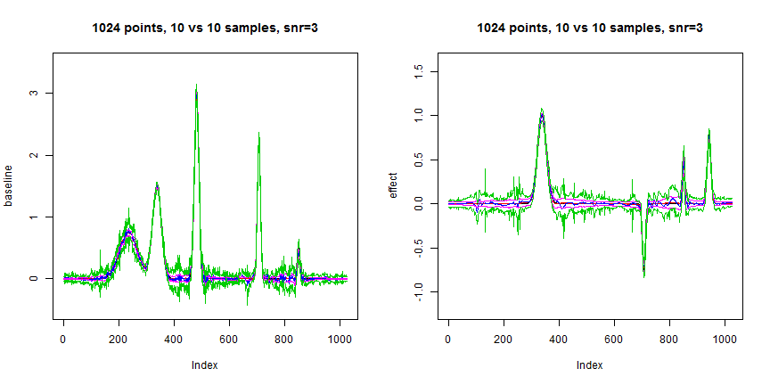

##Multiple signals

We briefly look at a very simple simulation in which there are multiple signals falling into 2 groups, and our goal is to find out the differences between the two groups. We assume that the variances for each signal could be different, but the mean for each group is the same


```r
source(file.path("../Rcode/bayesmooth.R"))
source(file.path("../Rcode/multiseq_gaus.R"))
source(file.path("../Rcode/multi_lmm.R"))


n = 1024
t = 1:n/n

spike.f = function(x) (0.75 * exp(-500 * (x - 0.23)^2) + 1.5 * exp(-2000 * (x - 
    0.33)^2) + 3 * exp(-8000 * (x - 0.47)^2) + 2.25 * exp(-16000 * (x - 0.69)^2) + 
    0.5 * exp(-32000 * (x - 0.83)^2))
spikem.f = function(x) (0.75 * exp(-500 * (x - 0.23)^2) + 2.5 * exp(-2000 * 
    (x - 0.33)^2) + 3 * exp(-8000 * (x - 0.47)^2) + 1.5 * exp(-16000 * (x - 
    0.69)^2) + 1 * exp(-32000 * (x - 0.83)^2) + 0.8 * exp(-12000 * (x - 0.92)^2))

dop.f = function(x) sqrt(x * (1 - x)) * sin((2 * pi * 1.05)/(x + 0.05))
mu.dop = dop.f(t)
mu.dop = 3/(max(mu.dop) - min(mu.dop)) * (mu.dop - min(mu.dop))
mu.dop.var = 10 * dop.f(t)
mu.dop.var = mu.dop.var - min(mu.dop.var)


pos = c(0.1, 0.13, 0.15, 0.23, 0.25, 0.4, 0.44, 0.65, 0.76, 0.78, 0.81)
hgt = 2.97/5 * c(4, 5, 3, 4, 5, 4.2, 2.1, 4.3, 3.1, 5.1, 4.2)
wth = c(0.005, 0.005, 0.006, 0.01, 0.01, 0.03, 0.01, 0.01, 0.005, 0.008, 0.005)
mu.b = rep(0, n)
for (j in 1:length(pos)) {
    mu.b = mu.b + hgt[j]/((1 + (abs(t - pos[j])/wth[j]))^4)
}


pos = c(0.1, 0.13, 0.15, 0.23, 0.25, 0.4, 0.44, 0.65, 0.76, 0.78, 0.81)
hgt = 2.88/5 * c(4, (-5), 3, (-4), 5, (-4.2), 2.1, 4.3, (-3.1), 2.1, (-4.2))
mu.blk = rep(0, n)
for (j in 1:length(pos)) {
    mu.blk = mu.blk + (1 + sign(t - pos[j])) * (hgt[j]/2)
}

mu.sp = spike.f(t)
mu.spm = spikem.f(t)


var1 = rep(1, n)
var2 = (1e-04 + 4 * (exp(-550 * (t - 0.2)^2) + exp(-200 * (t - 0.5)^2) + exp(-950 * 
    (t - 0.8)^2)))
var3 = (1e-05 + 2 * mu.dop.var)
var4 = 1e-05 + mu.b


sigma.ini.v1 = sqrt(var1)
sigma.ini.v2 = sqrt(var2)
sigma.ini.v3 = sqrt(var3)
sigma.ini.v4 = sqrt(var4)


rsnr = sqrt(3)
sigma.0.v1 = sigma.ini.v1/mean(sigma.ini.v1) * sd(mu.sp)/rsnr^2
sigma.0.v2 = sigma.ini.v2/mean(sigma.ini.v2) * sd(mu.sp)/rsnr^2
sigma.0.v3 = sigma.ini.v3/mean(sigma.ini.v3) * sd(mu.sp)/rsnr^2
sigma.0.v4 = sigma.ini.v4/mean(sigma.ini.v4) * sd(mu.sp)/rsnr^2

sigma.1.v1 = sigma.ini.v1/mean(sigma.ini.v1) * sd(mu.spm)/rsnr^2
sigma.1.v2 = sigma.ini.v2/mean(sigma.ini.v2) * sd(mu.spm)/rsnr^2
sigma.1.v3 = sigma.ini.v3/mean(sigma.ini.v3) * sd(mu.spm)/rsnr^2
sigma.1.v4 = sigma.ini.v4/mean(sigma.ini.v4) * sd(mu.spm)/rsnr^2


set.seed(1112)
X.1 = matrix(rnorm(10 * n, mu.sp, c(rep(sigma.0.v1, 2), rep(sigma.0.v2, 4), 
    rep(sigma.0.v3, 4))), nrow = 10, byrow = TRUE)
set.seed(1112)
X.2 = matrix(rnorm(10 * n, mu.spm, c(rep(sigma.1.v2, 3), rep(sigma.1.v3, 2), 
    rep(sigma.1.v4, 5))), nrow = 10, byrow = TRUE)

X = rbind(X.1, X.2)

g = c(rep(0, 10), rep(1, 10))

mse = function(x, y) mean((x - y)^2)

system.time(res <- multiseq.gaus(X, g, gridmult = 2))
```

```
##    user  system elapsed 
##   73.50    0.02   74.16
```

```r

## load in results from the method in Morris (2006)
wfmm.res = read.table("../simulation_g/test_eg_beta.txt")
wfmm.res.quan = read.table("../simulation_g/test_eg_beta_quan.txt")
wfmm.res = data.matrix(wfmm.res)
wfmm.res.quan = data.matrix(wfmm.res.quan)

```


```r
par(mfrow = c(1, 2))

plot(mu.sp, type = "l", ylim = c(-0.5, 3.5), main = "1024 points, 10 vs 10 samples, snr=3", 
    ylab = "baseline")

lines(res$baseline.mean, col = 2)
lines(wfmm.res[1, ], col = 4)

lines(res$baseline.mean - 2 * sqrt(res$baseline.var), col = 6)
lines(res$baseline.mean + 2 * sqrt(res$baseline.var), col = 6)

lines(wfmm.res.quan[1, 1:1024], col = 3)
lines(wfmm.res.quan[8, 1:1024], col = 3)


plot(mu.spm - mu.sp, type = "l", ylim = c(-1.2, 1.6), main = "1024 points, 10 vs 10 samples, snr=3", 
    ylab = "effect")

lines(res$effect.mean, col = 2)
lines(wfmm.res[2, ], col = 4)


lines(res$effect.mean - 2 * sqrt(res$effect.var), col = 6)
lines(res$effect.mean + 2 * sqrt(res$effect.var), col = 6)

lines(wfmm.res.quan[1, 1025:2048], col = 3)
lines(wfmm.res.quan[8, 1025:2048], col = 3)
```

 


