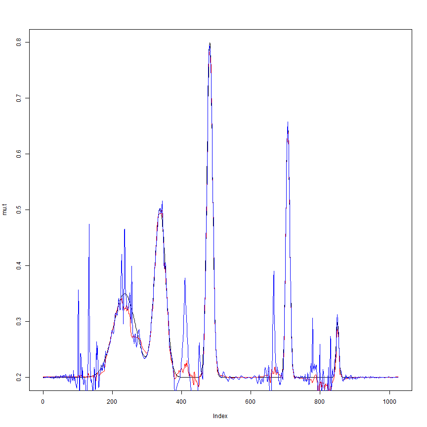

##Some other attempts

We try dividing the data by the standard deviation so that the new data will be iid. Here we work with the true standard deviation.


```r
source(file.path("../Rcode/bayesmooth.R"))
spike.f = function(x) (0.75 * exp(-500 * (x - 0.23)^2) + 1.5 * exp(-2000 * (x - 
    0.33)^2) + 3 * exp(-8000 * (x - 0.47)^2) + 2.25 * exp(-16000 * (x - 0.69)^2) + 
    0.5 * exp(-32000 * (x - 0.83)^2))


pos = c(0.1, 0.13, 0.15, 0.23, 0.25, 0.4, 0.44, 0.65, 0.76, 0.78, 0.81)
hgt = 2.97/5 * c(4, 5, 3, 4, 5, 4.2, 2.1, 4.3, 3.1, 5.1, 4.2)
wth = c(0.005, 0.005, 0.006, 0.01, 0.01, 0.03, 0.01, 0.01, 0.005, 0.008, 0.005)
mu.b = rep(0, n)
for (j in 1:length(pos)) {
    mu.b = mu.b + hgt[j]/((1 + (abs(t - pos[j])/wth[j]))^4)
}

n = 1024
t = 1:n/n

mu.s = spike.f(t)

mu.t = (1 + mu.s)/5

rsnr = sqrt(3)

var1 = rep(1, n)
var2 = (1e-04 + 4 * (exp(-550 * (t - 0.2)^2) + exp(-200 * (t - 0.5)^2) + exp(-950 * 
    (t - 0.8)^2)))/1.35
var3 = 1e-05 + mu.b
sigma.ini = sqrt(var3)
sigma.t = sigma.ini/mean(sigma.ini) * sd(mu.t)/rsnr^2

set.seed(1025)
X.s = rnorm(n, mu.t, sigma.t)

mu.est <- bayesmooth(X.s, sigma = sigma.t)
```

```
## Error: (subscript) logical subscript too long
```

```r
mu.est.sig = sigma.t * bayesmooth(X.s/sigma.t, sigma = rep(1, n))
```

```
## Error: (subscript) logical subscript too long
```

```r

mse(mu.est, mu.t)
```

```
## [1] 9.49e-05
```

```r
mse(mu.est.sig, mu.t)
```

```
## [1] 0.0007852
```


```r
plot(mu.t, type = "l")
lines(mu.est, col = 2)
lines(mu.est.sig, col = 4)
```

 


So dividing the data by its SD does change some of the underlying properties of the original intensity, and does not perform as well as one hopes.

Next we look at better ways to estimate the variance. One way would be to log transform the squared residuals so that they have constant variance. We also try using jash and vash instead of ash. For simplicity, we assume that the true mean is known. 


```r


spike.f = function(x) (0.75 * exp(-500 * (x - 0.23)^2) + 1.5 * exp(-2000 * (x - 
    0.33)^2) + 3 * exp(-8000 * (x - 0.47)^2) + 2.25 * exp(-16000 * (x - 0.69)^2) + 
    0.5 * exp(-32000 * (x - 0.83)^2))
n = 2^12
t = 1:n/n
mu.s = spike.f(t)
pos = c(0.1, 0.13, 0.15, 0.23, 0.25, 0.4, 0.44, 0.65, 0.76, 0.78, 0.81)
hgt = c(2, 3.6, 2, 5, 7.5, 6.9, 2, 4.8, 2, 4.1, 2.3)
wth = c(0.005, 0.005, 0.006, 0.01, 0.01, 0.03, 0.01, 0.01, 0.005, 0.008, 0.005)
mu.b = rep(0, n)
for (j in 1:length(pos)) {
    mu.b = mu.b + hgt[j]/((1 + (abs(t - pos[j])/wth[j]))^4)
}
dop.f = function(x) sqrt(x * (1 - x)) * sin((2 * pi * 1.05)/(x + 0.05))
mu.dop = dop.f(t)
mu.sine = sin(20 * t)
var1 = 1.42 * ((3 - 20 * t) * (t >= 0 & t < 0.1) + (20 * t - 1) * (t >= 0.1 & 
    t < 0.25) + (4 + (1 - 4 * t) * 18/19) * (t >= 0.25 & t < 0.725) + (2.2 + 
    10 * (t - 0.725)) * (t >= 0.725 & t < 0.89) + (3.85 - 85 * (t - 0.89)/11) * 
    (t >= 0.89 & t <= 1))
var2 = (1 + 4 * (exp(-550 * (t - 0.2)^2) + exp(-200 * (t - 0.5)^2) + exp(-950 * 
    (t - 0.8)^2)))/1.35
var3 = mu.b
var4 = 3.4 * (2 + mu.dop)
sigma.t.1 = sqrt(var1)
sigma.t.2 = sqrt(var2)
sigma.t.3 = sqrt(var3)
sigma.t.4 = sqrt(var4)
mu.t.1 = rep(0, n)
mu.t.2 = mu.sine

l2norm = function(x) sum(x^2)
mise = function(x, y) l2norm(x - y)/l2norm(y)
mse = function(x, y) mean((x - y)^2)


set.seed(327)
X.11 = rnorm(n, mu.t.1, sigma.t.1)
set.seed(327)
X.12 = rnorm(n, mu.t.1, sigma.t.2)
set.seed(327)
X.13 = rnorm(n, mu.t.1, sigma.t.3)
set.seed(327)
X.14 = rnorm(n, mu.t.1, sigma.t.4)
set.seed(327)
X.21 = rnorm(n, mu.t.2, sigma.t.1)
set.seed(327)
X.22 = rnorm(n, mu.t.2, sigma.t.2)
set.seed(327)
X.23 = rnorm(n, mu.t.2, sigma.t.3)
set.seed(327)
X.24 = rnorm(n, mu.t.2, sigma.t.4)


source("../simulation_1d_g/wip/bayesmooth_cur.R")
system.time(var.est.cur.11 <- bayesmooth.cur(X.11, mu.t.1))
```

```
##    user  system elapsed 
##    2.81    0.00    2.93
```

```r
system.time(var.est.cur.12 <- bayesmooth.cur(X.12, mu.t.1))
```

```
##    user  system elapsed 
##    2.37    0.00    2.37
```

```r
system.time(var.est.cur.13 <- bayesmooth.cur(X.13, mu.t.1))
```

```
##    user  system elapsed 
##     2.2     0.0     2.2
```

```r
system.time(var.est.cur.14 <- bayesmooth.cur(X.14, mu.t.1))
```

```
##    user  system elapsed 
##    3.04    0.00    3.04
```

```r
system.time(var.est.cur.21 <- bayesmooth.cur(X.21, mu.t.2))
```

```
##    user  system elapsed 
##    2.54    0.00    2.56
```

```r
system.time(var.est.cur.22 <- bayesmooth.cur(X.22, mu.t.2))
```

```
##    user  system elapsed 
##    2.23    0.00    2.26
```

```r
system.time(var.est.cur.23 <- bayesmooth.cur(X.23, mu.t.2))
```

```
##    user  system elapsed 
##    2.09    0.00    2.09
```

```r
system.time(var.est.cur.24 <- bayesmooth.cur(X.24, mu.t.2))
```

```
##    user  system elapsed 
##    3.05    0.00    3.05
```

```r

source("../simulation_1d_g/wip/bayesmooth_log.R")
system.time(var.est.log.11 <- bayesmooth.log(X.11, mu.t.1, sigma.t.1))
```

```
##    user  system elapsed 
##     2.6     0.0     2.6
```

```r
system.time(var.est.log.12 <- bayesmooth.log(X.12, mu.t.1, sigma.t.2))
```

```
##    user  system elapsed 
##    2.20    0.00    2.21
```

```r
system.time(var.est.log.13 <- bayesmooth.log(X.13, mu.t.1, sigma.t.3))
```

```
##    user  system elapsed 
##    1.85    0.00    1.86
```

```r
system.time(var.est.log.14 <- bayesmooth.log(X.14, mu.t.1, sigma.t.4))
```

```
##    user  system elapsed 
##    2.95    0.00    2.95
```

```r
system.time(var.est.log.21 <- bayesmooth.log(X.21, mu.t.2, sigma.t.1))
```

```
##    user  system elapsed 
##    2.59    0.00    2.60
```

```r
system.time(var.est.log.22 <- bayesmooth.log(X.22, mu.t.2, sigma.t.2))
```

```
##    user  system elapsed 
##    2.25    0.00    2.25
```

```r
system.time(var.est.log.23 <- bayesmooth.log(X.23, mu.t.2, sigma.t.3))
```

```
##    user  system elapsed 
##    1.86    0.00    1.87
```

```r
system.time(var.est.log.24 <- bayesmooth.log(X.24, mu.t.2, sigma.t.4))
```

```
##    user  system elapsed 
##    2.95    0.00    3.01
```

```r

source("../simulation_1d_g/wip/bayesmooth_vash.R")
system.time(var.est.vash.11 <- bayesmooth.vash(X.11, mu.t.1))
```

```
##    user  system elapsed 
##  348.26   36.48  385.30
```

```r
system.time(var.est.vash.12 <- bayesmooth.vash(X.12, mu.t.1))
```

```
##    user  system elapsed 
##  292.67   32.71  325.76
```

```r
system.time(var.est.vash.13 <- bayesmooth.vash(X.13, mu.t.1))
```

```
##    user  system elapsed 
##  378.70   39.94  419.34
```

```r
system.time(var.est.vash.14 <- bayesmooth.vash(X.14, mu.t.1))
```

```
##    user  system elapsed 
##  347.98   40.13  388.82
```

```r
system.time(var.est.vash.21 <- bayesmooth.vash(X.21, mu.t.2))
```

```
##    user  system elapsed 
##  343.78   37.51  381.75
```

```r
system.time(var.est.vash.22 <- bayesmooth.vash(X.22, mu.t.2))
```

```
##    user  system elapsed 
##  279.89   28.08  308.93
```

```r
system.time(var.est.vash.23 <- bayesmooth.vash(X.23, mu.t.2))
```

```
##    user  system elapsed 
##  370.08   40.45  423.62
```

```r
system.time(var.est.vash.24 <- bayesmooth.vash(X.24, mu.t.2))
```

```
##    user  system elapsed 
##  345.87   37.75  385.32
```

```r

source("../simulation_1d_g/wip/bayesmooth_jash.R")
system.time(var.est.jash.11 <- bayesmooth.jash(X.11, mu.t.1))
```

```
##    user  system elapsed 
##   65.09    0.03   65.35
```

```r
system.time(var.est.jash.12 <- bayesmooth.jash(X.12, mu.t.1))
```

```
##    user  system elapsed 
##   34.40    0.00   34.41
```

```r
system.time(var.est.jash.13 <- bayesmooth.jash(X.13, mu.t.1))
```

```
##    user  system elapsed 
##   44.30    0.00   44.82
```

```r
system.time(var.est.jash.14 <- bayesmooth.jash(X.14, mu.t.1))
```

```
##    user  system elapsed 
##   56.06    0.02   56.30
```

```r
system.time(var.est.jash.21 <- bayesmooth.jash(X.21, mu.t.2))
```

```
##    user  system elapsed 
##   60.59    0.03   60.95
```

```r
system.time(var.est.jash.22 <- bayesmooth.jash(X.22, mu.t.2))
```

```
##    user  system elapsed 
##   32.18    0.00   32.26
```

```r
system.time(var.est.jash.23 <- bayesmooth.jash(X.23, mu.t.2))
```

```
##    user  system elapsed 
##   46.99    0.01   47.10
```

```r
system.time(var.est.jash.24 <- bayesmooth.jash(X.24, mu.t.2))
```

```
##    user  system elapsed 
##   69.76    0.04   70.10
```

```r


matrix(c(mse(var.est.cur.11, sigma.t.1^2), mse(var.est.cur.12, sigma.t.2^2), 
    mse(var.est.cur.13, sigma.t.3^2), mse(var.est.cur.14, sigma.t.4^2), mse(var.est.log.11, 
        sigma.t.1^2), mse(var.est.log.12, sigma.t.2^2), mse(var.est.log.13, 
        sigma.t.3^2), mse(var.est.log.14, sigma.t.4^2), mse(var.est.vash.11, 
        sigma.t.1^2), mse(var.est.vash.12, sigma.t.2^2), mse(var.est.vash.13, 
        sigma.t.3^2), mse(var.est.vash.14, sigma.t.4^2), mse(var.est.jash.11, 
        sigma.t.1^2), mse(var.est.jash.12, sigma.t.2^2), mse(var.est.jash.13, 
        sigma.t.3^2), mse(var.est.jash.14, sigma.t.4^2)), 4, 4)
```

```
##         [,1]     [,2]    [,3]    [,4]
## [1,] 0.07675 126063.0 0.08657 0.08734
## [2,] 0.05053   3294.4 0.04575 0.05407
## [3,] 0.18877    104.2 0.19964 0.16015
## [4,] 0.58056 285758.6 0.60028 0.50585
```

```r


matrix(c(mse(var.est.cur.21, sigma.t.1^2), mse(var.est.cur.22, sigma.t.2^2), 
    mse(var.est.cur.23, sigma.t.3^2), mse(var.est.cur.24, sigma.t.4^2), mse(var.est.log.21, 
        sigma.t.1^2), mse(var.est.log.22, sigma.t.2^2), mse(var.est.log.23, 
        sigma.t.3^2), mse(var.est.log.24, sigma.t.4^2), mse(var.est.vash.21, 
        sigma.t.1^2), mse(var.est.vash.22, sigma.t.2^2), mse(var.est.vash.23, 
        sigma.t.3^2), mse(var.est.vash.24, sigma.t.4^2), mse(var.est.jash.21, 
        sigma.t.1^2), mse(var.est.jash.22, sigma.t.2^2), mse(var.est.jash.23, 
        sigma.t.3^2), mse(var.est.jash.24, sigma.t.4^2)), 4, 4)
```

```
##         [,1]     [,2]    [,3]    [,4]
## [1,] 0.07675 126063.0 0.08657 0.08734
## [2,] 0.05053   3294.4 0.04575 0.05407
## [3,] 0.18877    104.2 0.19964 0.16015
## [4,] 0.58056 285758.6 0.60028 0.50585
```

```r

```

